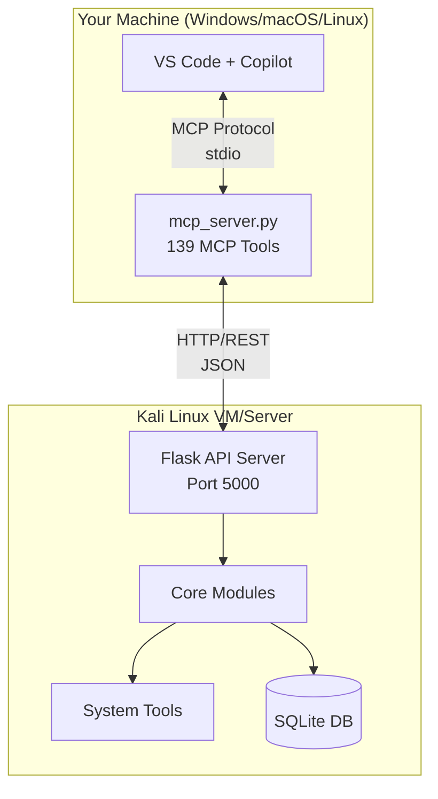
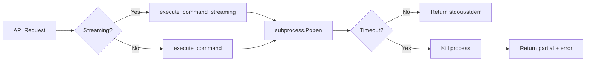
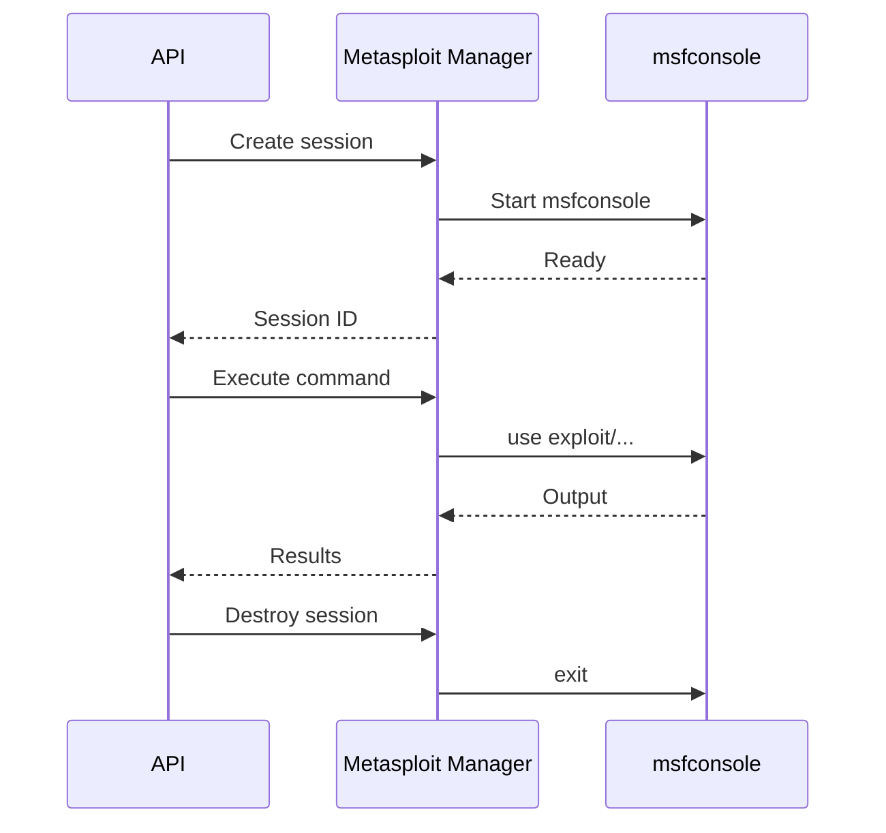
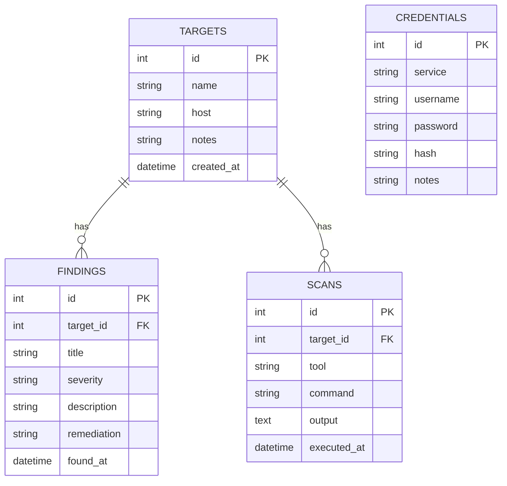
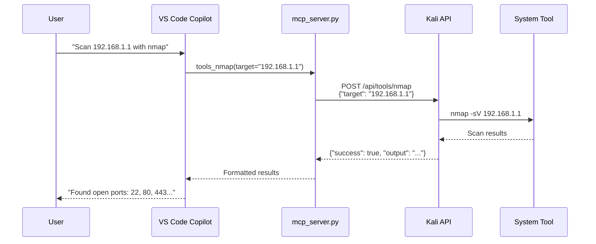

# Architecture

This document provides a deep dive into the Zebbern-MCP architecture, explaining how all components work together.

---

## System Overview

Zebbern-MCP follows a client-server architecture where an MCP client on your local machine communicates with a REST API server running on Kali Linux.



---

## Component Details

### 1. MCP Client (`mcp_server.py`)

The MCP client is a Python application that implements the Model Context Protocol, allowing VS Code Copilot to invoke penetration testing tools.

```
mcp_server.py              # Entry point & KaliToolsClient
├── KaliToolsClient class
│   ├── HTTP connection to Kali API
│   ├── Request timeout handling
│   └── Error handling & retries
│
├── FastMCP Server initialization
│   └── stdio transport for VS Code
│
└── mcp_tools/             # 139 @mcp.tool() functions (16 modules)
    ├── recon.py            # Reconnaissance tools
    ├── web.py              # Web application tools
    ├── api_security.py     # API testing tools
    ├── exploitation.py     # Exploit tools
    ├── ad.py               # Active Directory tools
    ├── pivoting.py         # Network pivoting tools
    └── ... (see Tools Reference)
```

**Key Features:**

| Feature | Description |
|---------|-------------|
| **Auto-reconnect** | Automatically retries failed connections |
| **Timeout handling** | Configurable timeouts for long-running scans |
| **Streaming support** | Real-time output for slow commands |
| **Error normalization** | Consistent error format across all tools |

**Configuration:**

```python
DEFAULT_KALI_SERVER = "http://192.168.44.131:5000"
DEFAULT_REQUEST_TIMEOUT = 300  # 5 minutes
```

---

### 2. Kali API Server

The Flask-based REST API server runs on Kali Linux and provides endpoints for all security tools.

```
zebbern-kali/
├── kali_server.py          # Flask app entry point
├── api/
│   ├── routes.py           # Entry point — registers all blueprints (11 lines)
│   └── blueprints/         # Modular route handlers
│       ├── __init__.py     # Blueprint registration
│       ├── _helpers.py     # Shared streaming helpers
│       ├── health.py       # Health check
│       ├── command.py      # Command execution
│       ├── tools.py        # 31 tool endpoints (nmap, gobuster, etc.)
│       ├── metasploit.py   # Metasploit session management
│       ├── ssh.py          # SSH session management
│       ├── reverse_shell.py # Reverse shell management
│       ├── file_ops.py     # File upload/download
│       ├── payload.py      # Payload generation
│       ├── exploit.py      # Exploit suggester
│       ├── evidence.py     # Evidence collection
│       ├── fingerprint.py  # Web fingerprinting
│       ├── database.py     # Target database CRUD
│       ├── sessions.py     # Session save/restore + I/O
│       ├── js_analyzer.py  # JavaScript analysis
│       ├── api_security.py # API security testing
│       ├── ad.py           # Active Directory tools
│       └── pivot.py        # Network pivoting
├── core/                   # Core functionality modules
│   ├── config.py           # Configuration & logging
│   ├── command_executor.py # Safe command execution
│   ├── ssh_manager.py      # SSH session management
│   ├── reverse_shell_manager.py
│   ├── metasploit_manager.py
│   ├── payload_generator.py
│   ├── exploit_suggester.py
│   ├── evidence_manager.py
│   ├── fingerprint_manager.py
│   ├── database_manager.py
│   ├── session_manager.py
│   ├── js_analyzer.py
│   ├── api_security.py
│   ├── ad_tools.py
│   ├── pivoting.py
│   └── tool_config.py
├── tools/
│   └── kali_tools.py       # Tool execution wrappers
├── utils/
│   └── kali_operations.py  # File operations
└── database/
    └── pentest.db          # SQLite database
```

---

### 3. Core Modules

Each core module handles a specific domain of functionality:

#### Command Executor (`command_executor.py`)



**Features:**

- Configurable timeouts (default: 300s)
- Streaming output for long operations
- Safe argument handling (shlex)
- Output truncation for large results

#### SSH Manager (`ssh_manager.py`)

Manages persistent SSH connections to remote hosts:

```python
# Global session storage
ssh_sessions: Dict[str, SSHSession] = {}

class SSHSession:
    client: paramiko.SSHClient
    sftp: Optional[paramiko.SFTPClient]
    host: str
    username: str
    connected_at: datetime
```

**Capabilities:**

- Connect/disconnect sessions
- Execute remote commands
- File upload/download via SFTP
- Port forwarding tunnels
- Session persistence across requests

#### Metasploit Manager (`metasploit_manager.py`)

Controls persistent msfconsole sessions:



#### Reverse Shell Manager (`reverse_shell_manager.py`)

Manages netcat/pwncat listeners:

| Function | Description |
|----------|-------------|
| `start_listener` | Start nc/pwncat on specified port |
| `stop_listener` | Kill listener process |
| `list_listeners` | Show all active listeners |
| `get_active_shells` | List captured shells |
| `interact_shell` | Send commands to shell |

#### Evidence Manager (`evidence_manager.py`)

Stores and organizes penetration test artifacts:

```
evidence/
├── screenshots/
│   └── target_20260105_143022.png
├── notes/
│   └── note_001.md
└── outputs/
    └── nmap_scan_001.txt
```

---

### 4. Database Schema

SQLite database for persistent storage:



---

### 5. Request Flow

Complete flow of an MCP tool invocation:



---

## Directory Structure

Complete project layout:

```
zebbern-mcp/
├── mcp_server.py           # MCP client (runs on your machine)
├── install.py              # Cross-platform installer
├── install.sh              # Bash installer for Kali
├── requirements.txt        # Python dependencies
├── mkdocs.yml              # Documentation config
├── README.md               # Project readme
│
├── docs/                   # Documentation (MkDocs)
│   ├── index.md
│   ├── architecture.md
│   ├── installation.md
│   └── ...
│
├── zebbern-kali/           # API server (deployed to Kali)
│   ├── kali_server.py      # Flask entry point
│   ├── api/
│   │   ├── routes.py       # Entry point (registers blueprints)
│   │   └── blueprints/     # 17 modular route modules
│   ├── core/               # Core modules
│   │   ├── config.py
│   │   ├── command_executor.py
│   │   ├── ssh_manager.py
│   │   ├── reverse_shell_manager.py
│   │   ├── metasploit_manager.py
│   │   ├── payload_generator.py
│   │   ├── exploit_suggester.py
│   │   ├── evidence_manager.py
│   │   ├── fingerprint_manager.py
│   │   ├── database_manager.py
│   │   ├── session_manager.py
│   │   ├── js_analyzer.py
│   │   ├── api_security.py
│   │   ├── ad_tools.py
│   │   ├── pivoting.py
│   │   └── tool_config.py
│   ├── tools/
│   │   └── kali_tools.py   # Tool wrappers
│   ├── utils/
│   │   └── kali_operations.py
│   └── database/
│       └── pentest.db
│
└── .vscode/
    └── mcp.json            # Workspace MCP config
```

---

## Network Architecture

### Recommended Setup

```
┌─────────────────────────────────────────────────────────────────────┐
│                        YOUR NETWORK                                 │
├─────────────────────────────────────────────────────────────────────┤
│                                                                     │
│  ┌─────────────┐        ┌─────────────┐        ┌─────────────────┐ │
│  │  Your PC    │        │  Kali VM    │        │  Target Network │ │
│  │             │◄──────►│             │◄──────►│                 │ │
│  │ MCP Client  │  NAT/  │ API Server  │  NAT/  │  Test Systems   │ │
│  │             │ Bridge │ Port 5000   │ Bridge │                 │ │
│  └─────────────┘        └─────────────┘        └─────────────────┘ │
│                                                                     │
└─────────────────────────────────────────────────────────────────────┘
```

### Port Requirements

| Port | Service | Direction | Description |
|------|---------|-----------|-------------|
| 5000 | API Server | Inbound to Kali | REST API |
| 22 | SSH | Outbound from Kali | Remote target access |
| 4444+ | Reverse Shells | Inbound to Kali | Shell listeners |
| 1080 | SOCKS Proxy | As needed | Pivoting |

---

## Technology Stack

| Layer | Technology |
|-------|------------|
| **MCP Protocol** | FastMCP (Python) |
| **API Framework** | Flask 2.3+ |
| **Database** | SQLite 3 |
| **SSH Client** | Paramiko |
| **Process Execution** | subprocess, shlex |
| **Serialization** | JSON |
| **Service Manager** | systemd |

---

## Scalability Considerations

### Current Limitations

- Single Kali server instance
- SQLite database (not for concurrent writes)
- No authentication on API server
- Session state stored in memory

### Future Enhancements

- [ ] Multi-server support with load balancing
- [ ] PostgreSQL for concurrent access
- [ ] API authentication (JWT/API keys)
- [ ] Redis for session state
- [ ] WebSocket for real-time updates
