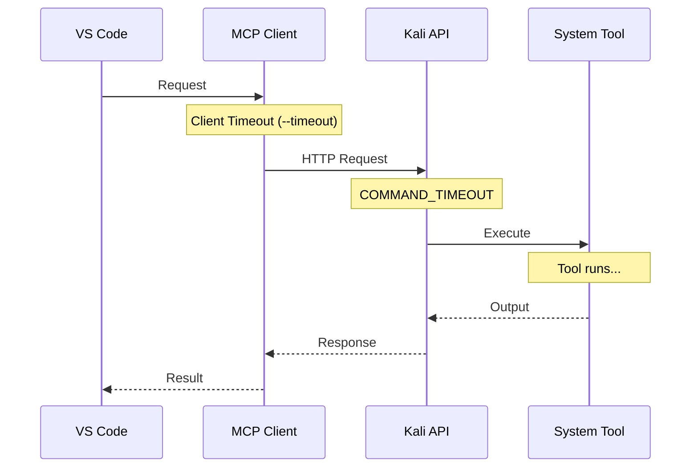

# Configuration

This guide covers all configuration options for Zebbern-MCP.

---

## Overview

Configuration is split across three locations:

| Location | Purpose |
|----------|---------|
| VS Code MCP Config | Define how to launch the MCP client |
| MCP Client Args | Kali server URL, timeout, debug mode |
| Kali Server Config | API port, timeouts, logging |

---

## VS Code MCP Configuration

### Workspace Configuration

Create `.vscode/mcp.json` in your workspace:

```json
{
  "servers": {
    "kali-mcp": {
      "type": "stdio",
      "command": "${workspaceFolder}/venv/Scripts/python.exe",
      "args": [
        "${workspaceFolder}/mcp_server.py",
        "--server", "http://192.168.1.100:5000"
      ]
    }
  }
}
```

### Global Configuration

=== "Windows"
    ```
    %APPDATA%\Code\User\mcp.json
    ```

=== "macOS"
    ```
    ~/Library/Application Support/Code/User/mcp.json
    ```

=== "Linux"
    ```
    ~/.config/Code/User/mcp.json
    ```

**Example:**
```json
{
  "servers": {
    "kali-mcp": {
      "type": "stdio",
      "command": "C:\\path\\to\\venv\\Scripts\\python.exe",
      "args": [
        "C:\\path\\to\\mcp_server.py",
        "--server", "http://192.168.1.100:5000",
        "--timeout", "600"
      ]
    }
  }
}
```

### Configuration Options

| Field | Description |
|-------|-------------|
| `type` | Always `stdio` for MCP |
| `command` | Path to Python interpreter |
| `args` | Command-line arguments for mcp_server.py |

---

## MCP Client Arguments

The `mcp_server.py` accepts these command-line arguments:

```bash
python mcp_server.py [OPTIONS]
```

### Available Options

| Argument | Default | Description |
|----------|---------|-------------|
| `--server` | `http://192.168.44.131:5000` | Kali API server URL |
| `--timeout` | `300` | Request timeout in seconds |
| `--debug` | `false` | Enable debug logging |

### Examples

**Custom server address:**
```bash
python mcp_server.py --server http://10.0.0.50:5000
```

**Extended timeout for slow scans:**
```bash
python mcp_server.py --timeout 900
```

**Enable debug mode:**
```bash
python mcp_server.py --debug
```

**Combined:**
```bash
python mcp_server.py --server http://10.0.0.50:5000 --timeout 600 --debug
```

### In VS Code Config

```json
{
  "servers": {
    "kali-mcp": {
      "type": "stdio",
      "command": "python",
      "args": [
        "mcp_server.py",
        "--server", "http://192.168.1.100:5000",
        "--timeout", "600",
        "--debug"
      ]
    }
  }
}
```

---

## Kali Server Configuration

Server configuration is in `zebbern-kali/core/config.py`.

### Default Values

```python
# Version
VERSION = "1.0.0"

# Server port
API_PORT = int(os.environ.get("API_PORT", 5000))

# Command execution timeout (seconds)
COMMAND_TIMEOUT = 300

# Debug mode
DEBUG_MODE = os.environ.get("DEBUG_MODE", "0") == "1"

# Blocking timeout for interactive commands
BLOCKING_TIMEOUT = int(os.environ.get("BLOCKING_TIMEOUT", 5))
```

### Environment Variables

Set these in the systemd service or shell:

| Variable | Default | Description |
|----------|---------|-------------|
| `API_PORT` | `5000` | Port for Flask API server |
| `DEBUG_MODE` | `0` | Enable Flask debug mode (`1` = enabled) |
| `BLOCKING_TIMEOUT` | `5` | Timeout for blocking operations |

### Modify Systemd Service

Edit `/etc/systemd/system/kali-mcp.service`:

```ini
[Service]
Environment=API_PORT=5000
Environment=DEBUG_MODE=0
Environment=BLOCKING_TIMEOUT=5
Environment=PYTHONUNBUFFERED=1
```

Then reload:
```bash
sudo systemctl daemon-reload
sudo systemctl restart kali-mcp
```

---

## Timeout Configuration

### Understanding Timeouts



### Recommended Timeouts

| Scan Type | Timeout | Notes |
|-----------|---------|-------|
| Quick scans | 60s | dirb, gobuster small wordlist |
| Standard scans | 300s (default) | nmap -sV, nuclei |
| Deep scans | 900s | nmap -A, nikto full |
| Long-running | 1800s+ | sqlmap --dump, password cracking |

### Setting Per-Tool Timeouts

Some tools have their own timeout settings:

```json
{
  "target": "192.168.1.1",
  "additional_args": "--max-retries 1 --host-timeout 120s"
}
```

---

## Network Configuration

### Kali VM Network Setup

**Recommended: NAT + Host-Only Adapter**

```
┌─────────────────────────────────────────┐
│           VirtualBox/VMware            │
├─────────────────────────────────────────┤
│  Adapter 1: NAT                         │
│    - Internet access for updates        │
│                                         │
│  Adapter 2: Host-Only                   │
│    - IP: 192.168.56.x                   │
│    - Communication with host            │
└─────────────────────────────────────────┘
```

### Firewall Configuration

On Kali:
```bash
# Allow API port
sudo ufw allow 5000/tcp

# Allow common reverse shell ports
sudo ufw allow 4444:4450/tcp

# View rules
sudo ufw status
```

### Port Forwarding (NAT mode)

If using NAT only, set up port forwarding:

**VirtualBox:**
```
Settings → Network → Advanced → Port Forwarding
Host Port: 5000 → Guest Port: 5000
```

---

## Tool-Specific Configuration

### Nuclei Templates

Update templates regularly:
```bash
nuclei -update-templates
```

Custom template path:
```json
{
  "target": "http://example.com",
  "templates": "/custom/templates/",
  "additional_args": ""
}
```

### Wordlists

Default locations:
```
/usr/share/wordlists/
├── dirb/
│   ├── common.txt
│   └── big.txt
├── rockyou.txt
├── seclists/          # If installed
└── dirbuster/
```

### Shodan API Key

Configure Shodan CLI:
```bash
shodan init YOUR_API_KEY
```

### Metasploit Database

Initialize database:
```bash
sudo msfdb init
```

---

## Logging Configuration

### Server Logs

View real-time logs:
```bash
sudo journalctl -u kali-mcp -f
```

View last 100 lines:
```bash
sudo journalctl -u kali-mcp -n 100
```

### Log Levels

In `config.py`:
```python
import logging
logging.basicConfig(level=logging.DEBUG)  # or INFO, WARNING, ERROR
```

### Client Debug Mode

Enable debug output:
```bash
python mcp_server.py --debug
```

---

## Database Configuration

### Location

```
zebbern-kali/database/pentest.db
```

### Backup

```bash
cp /opt/zebbern-kali/database/pentest.db /backup/pentest_$(date +%Y%m%d).db
```

### Reset Database

```bash
rm /opt/zebbern-kali/database/pentest.db
# Database will be recreated on next API request
```

---

## Multiple Kali Servers

You can configure multiple Kali servers in VS Code:

```json
{
  "servers": {
    "kali-internal": {
      "type": "stdio",
      "command": "python",
      "args": ["mcp_server.py", "--server", "http://192.168.1.100:5000"]
    },
    "kali-external": {
      "type": "stdio",
      "command": "python",
      "args": ["mcp_server.py", "--server", "http://10.0.0.50:5000"]
    }
  }
}
```

---

## Environment-Specific Configs

### Development

```json
{
  "servers": {
    "kali-mcp": {
      "type": "stdio",
      "command": "python",
      "args": [
        "mcp_server.py",
        "--server", "http://localhost:5000",
        "--debug"
      ]
    }
  }
}
```

### Production

```json
{
  "servers": {
    "kali-mcp": {
      "type": "stdio",
      "command": "python",
      "args": [
        "mcp_server.py",
        "--server", "http://secure-kali.internal:5000",
        "--timeout", "600"
      ]
    }
  }
}
```

---

## Troubleshooting Configuration

!!! bug "Connection refused"
    Check Kali IP and port:
    ```bash
    curl http://YOUR_KALI_IP:5000/health
    ```

!!! bug "Timeout errors"
    Increase timeout:
    ```bash
    python mcp_server.py --timeout 900
    ```

!!! bug "Tools not found"
    Check health endpoint:
    ```bash
    curl http://YOUR_KALI_IP:5000/health | jq .tools_status
    ```

[:octicons-arrow-right-24: More Troubleshooting](troubleshooting.md)
