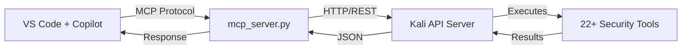

# Zebbern-MCP

**A powerful Model Context Protocol (MCP) server that connects VS Code Copilot to a full Kali Linux penetration testing toolkit.**

<div class="grid cards" markdown>

-   :material-rocket-launch:{ .lg .middle } **Quick Start**

    ---

    Get up and running in minutes with our installation scripts

    [:octicons-arrow-right-24: Installation Guide](installation.md)

-   :material-cog:{ .lg .middle } **145+ MCP Tools**

    ---

    Complete reference for all available penetration testing tools

    [:octicons-arrow-right-24: Tools Reference](tools-reference.md)

-   :material-api:{ .lg .middle } **100+ API Endpoints**

    ---

    RESTful API documentation for the Kali server

    [:octicons-arrow-right-24: API Reference](api-reference.md)

-   :material-book-open-variant:{ .lg .middle } **Workflow Guides**

    ---

    Real-world penetration testing scenarios and examples

    [:octicons-arrow-right-24: Workflows](workflows.md)

</div>

---

## What is Zebbern-MCP?

Zebbern-MCP bridges the gap between AI-powered coding assistants and professional penetration testing tools. It consists of two main components:



| Component | Description |
|-----------|-------------|
| **MCP Client** | Python server (`mcp_server.py`) with 145+ tool functions that runs locally |
| **Kali API Server** | Flask-based REST API running on Kali Linux with 100+ endpoints |
| **Security Tools** | 22+ pre-installed tools: nmap, sqlmap, nuclei, metasploit, and more |

---

## Key Features

### 🔧 Comprehensive Tool Coverage

- **Reconnaissance**: nmap, subfinder, assetfinder, waybackurls, httpx
- **Web Security**: nikto, sqlmap, nuclei, ffuf, gobuster, dirb
- **Credential Attacks**: hydra, john, hashcat
- **Exploitation**: metasploit, searchsploit, msfvenom payloads
- **Active Directory**: impacket, bloodhound, crackmapexec, kerberoasting
- **API Security**: arjun, kiterunner, JWT analysis, GraphQL testing
- **VPN Management**: WireGuard/OpenVPN connect/disconnect with SOCKS5 proxy
- **CTF Platform**: CTFd/rCTF integration, challenge management, flag submission
- **Browser Automation**: Headless Chromium via Playwright for JS-heavy targets

### 🔄 Session Management

- Persistent SSH sessions to remote hosts
- Metasploit session control
- Reverse shell listeners with auto-capture
- Network pivoting with chisel/ligolo

### 📊 Evidence & Reporting

- Screenshot capture
- Command output logging
- Findings database with severity ratings
- Credential storage
- Session save/restore

---

## Quick Start

=== "Windows/macOS (Client)"

    ```powershell
    # Clone and setup
    git clone https://github.com/zebbern/zebbern-kali-mcp.git
    cd zebbern-kali-mcp
    python install.py --client
    ```

=== "Kali Linux (Server)"

    ```bash
    # Full installation
    git clone https://github.com/zebbern/zebbern-kali-mcp.git
    cd zebbern-kali-mcp
    sudo ./install.sh
    ```

=== "Remote Install"

    ```bash
    # Install to remote Kali via SSH
    python install.py --remote --host 192.168.1.100 --user kali
    ```

After installation, add to VS Code's MCP configuration:

```json
{
  "servers": {
    "kali-mcp": {
      "type": "stdio",
      "command": "python",
      "args": ["path/to/mcp_server.py", "--server", "http://YOUR_KALI_IP:5000"]
    }
  }
}
```

[:octicons-arrow-right-24: Complete Installation Guide](installation.md)

---

## Architecture Overview

```
┌─────────────────────────────────────────────────────────────────┐
│                         YOUR MACHINE                            │
│  ┌──────────────────────────────────────────────────────────┐  │
│  │  VS Code + GitHub Copilot                                │  │
│  │       ↓ MCP (stdio)                                      │  │
│  │  mcp_server.py (139 tools)                               │  │
│  └──────────────────────────────────────────────────────────┘  │
└─────────────────────────────────────────────────────────────────┘
                              ↓ HTTP
┌─────────────────────────────────────────────────────────────────┐
│                      KALI LINUX VM                              │
│  ┌──────────────────────────────────────────────────────────┐  │
│  │  Flask API Server (port 5000)                            │  │
│  │       ↓                                                  │  │
│  │  Core Modules: SSH, Metasploit, Payloads, Evidence...    │  │
│  │       ↓                                                  │  │
│  │  System Tools: nmap, sqlmap, nuclei, hydra...            │  │
│  └──────────────────────────────────────────────────────────┘  │
└─────────────────────────────────────────────────────────────────┘
```

[:octicons-arrow-right-24: Full Architecture Documentation](architecture.md)

---

## Tool Categories at a Glance

| Category | Tools | MCP Functions |
|----------|-------|---------------|
| **Reconnaissance** | nmap, subfinder, httpx, assetfinder | 13 |
| **Web Application** | nikto, sqlmap, gobuster, dirb, ffuf | 9 |
| **API Security** | arjun, nuclei, kiterunner, JWT analysis | 12 |
| **Credential Attacks** | hydra, john, hashcat | 3 |
| **Active Directory** | impacket, bloodhound, kerberoasting | 10 |
| **Exploitation** | metasploit, searchsploit, msfvenom | 11 |
| **SSH/Remote** | ssh sessions, file transfer, tunneling | 8 |
| **Reverse Shells** | netcat, pwncat, listeners | 11 |
| **Pivoting** | chisel, ligolo, proxychains | 14 |
| **Evidence** | screenshots, notes, findings DB | 6 |
| **Session Mgmt** | save/restore, target tracking | 20 |
| **Other** | exec, fingerprint, network info | 22 |

**Total: 139 MCP tools** backed by **22+ system binaries**

[:octicons-arrow-right-24: Complete Tools Reference](tools-reference.md)

---

## System Requirements

### Client (Windows/macOS/Linux)
- Python 3.10+
- VS Code with GitHub Copilot
- Network access to Kali VM

### Server (Kali Linux)
- Kali Linux 2023.1 or newer
- Python 3.10+
- 4GB+ RAM recommended
- Root access for tool installation

---

## Security Notice

!!! warning "For Authorized Testing Only"

    This toolkit is designed for **authorized penetration testing** and security research.

    - Always obtain proper authorization before testing
    - The API server has **no authentication** by default
    - Run only on isolated networks or with proper firewall rules
    - See [Security Guide](security.md) for hardening recommendations

---

## Support

- :material-bug: [Report Issues](https://github.com/zebbern/zebbern-mcp/issues)
- :material-help-circle: [Troubleshooting Guide](troubleshooting.md)
- :material-account-group: [Contributing](contributing.md)
